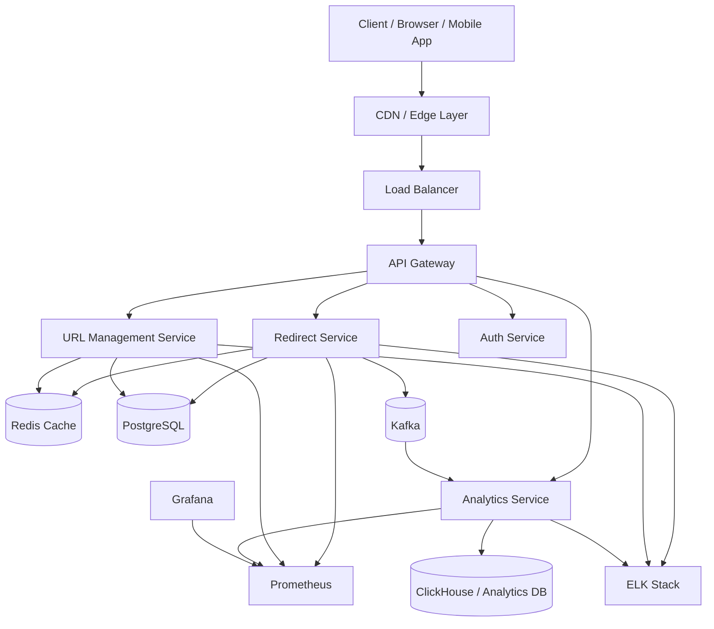
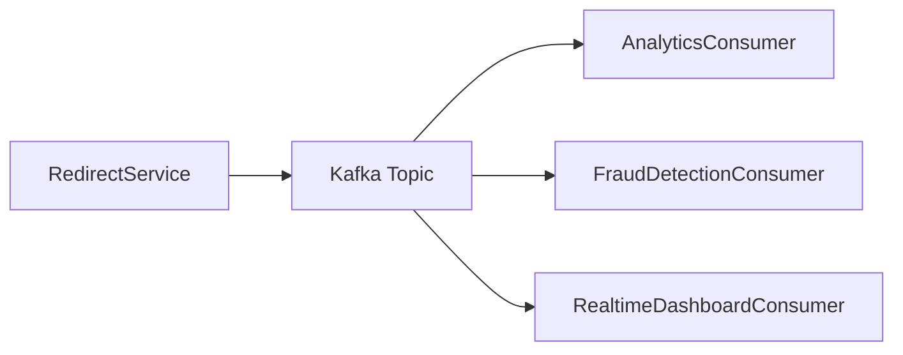
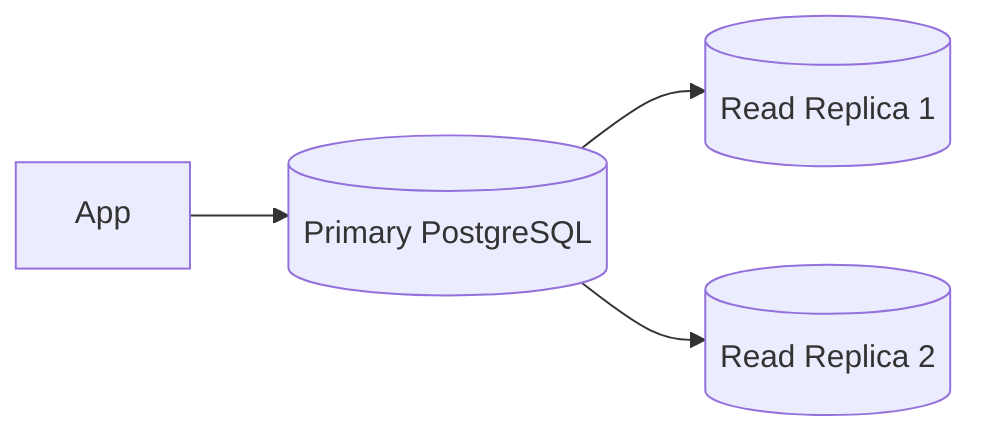
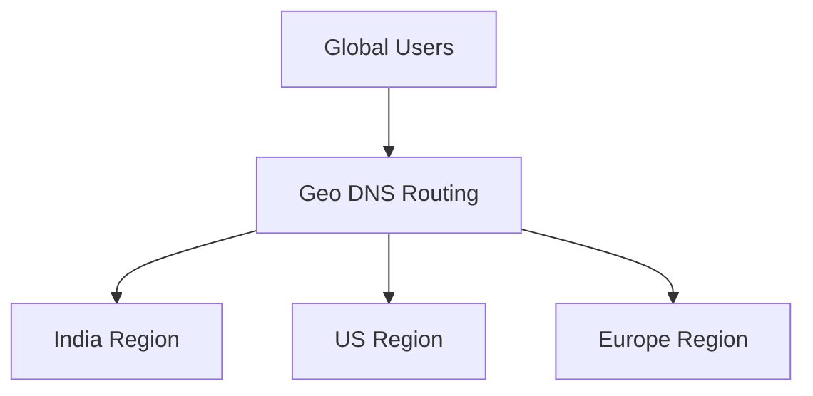
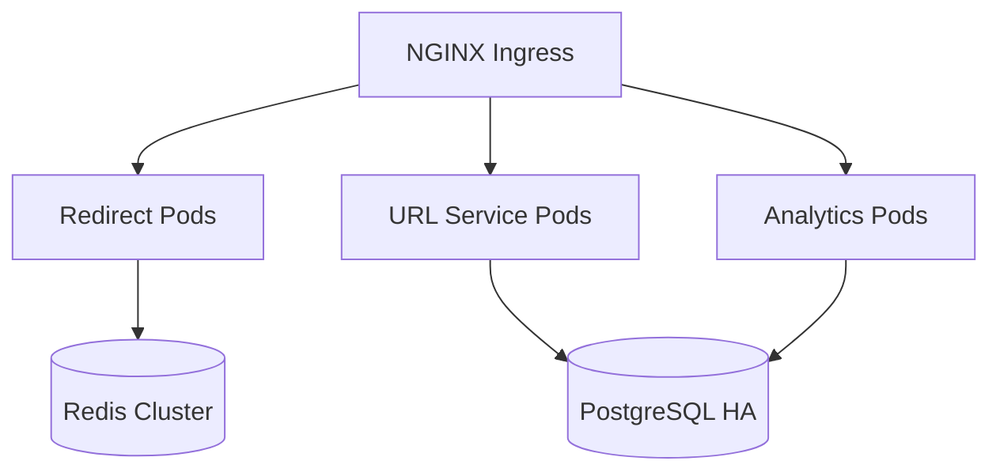
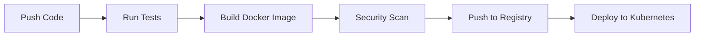

# 🔗 URL Shortener — Production Grade Spring Boot System

A scalable, production-ready URL shortening platform built using **Spring Boot**, **Redis**, **PostgreSQL**, **Kafka**, **Docker**, and **Kubernetes**.

This project demonstrates how modern distributed backend systems are designed for: 

* High availability
* Low latency redirects
* Massive traffic handling 
* Analytics processing
* Fault tolerance
* Horizontal scalability
* Production observability

---

# ✨ Features

## Core Features

* Create short URLs
* Custom aliases
* URL expiration
* One-time URLs
* QR code generation
* REST APIs
* Rate limiting
* Authentication & authorization
* User dashboard
* Click analytics
* Geo-location analytics
* Device/browser analytics
* Bulk URL shortening
* API keys

## Production Features

* Redis caching
* Distributed rate limiting
* Kafka event streaming
* Async analytics processing
* CDN-ready redirect layer
* Kubernetes deployment
* Circuit breaker patterns
* Centralized logging
* Metrics & monitoring
* OpenTelemetry tracing
* Blue-green deployments
* API Gateway support
* Multi-region architecture
* High availability database setup

---

# 🏗️ System Architecture

## High Level Architecture



---

# 🧠 Architecture Deep Dive

## 1. Redirect Flow (Critical Path)

The redirect flow is the most performance-sensitive component.

### Request Flow

```text
User clicks short URL
        ↓
CDN Edge Lookup
        ↓
Load Balancer
        ↓
Redirect Service
        ↓
Redis Cache Lookup
        ↓
Cache Hit? ── Yes ──> Return 301/302 Redirect
        ↓ No
PostgreSQL Lookup
        ↓
Populate Redis Cache
        ↓
Return Redirect
        ↓
Publish Analytics Event to Kafka
```

### Why This Architecture?

| Component   | Purpose                    |
| ----------- | -------------------------- |
| Redis       | Ultra-fast URL lookup      |
| Kafka       | Async analytics processing |
| CDN         | Edge acceleration          |
| PostgreSQL  | Durable storage            |
| API Gateway | Security & routing         |

---

# ⚡ Redirect Optimization Strategy

## Cache-First Strategy

Most redirects should never hit the database.

```text
Expected Flow:
95% Redis Cache Hit
5% PostgreSQL Fallback
```

## Redis Data Structure

```json
{
  "shortCode": "xYz12A",
  "originalUrl": "https://example.com/products/123",
  "expiresAt": "2027-01-01T00:00:00",
  "active": true
}
```

## Redis Key Design

```text
short:url:xYz12A
```

---

# 🗄️ Database Design

## PostgreSQL Schema

### urls Table

```sql
CREATE TABLE urls (
    id BIGSERIAL PRIMARY KEY,
    short_code VARCHAR(20) UNIQUE NOT NULL,
    original_url TEXT NOT NULL,
    user_id BIGINT,
    created_at TIMESTAMP NOT NULL,
    expires_at TIMESTAMP,
    click_count BIGINT DEFAULT 0,
    is_active BOOLEAN DEFAULT TRUE,
    custom_alias BOOLEAN DEFAULT FALSE
);
```

---

### users Table

```sql
CREATE TABLE users (
    id BIGSERIAL PRIMARY KEY,
    email VARCHAR(255) UNIQUE NOT NULL,
    password_hash TEXT NOT NULL,
    api_key VARCHAR(255),
    role VARCHAR(50),
    created_at TIMESTAMP
);
```

---

### analytics_events Table

```sql
CREATE TABLE analytics_events (
    id BIGSERIAL PRIMARY KEY,
    short_code VARCHAR(20),
    ip_address VARCHAR(100),
    country VARCHAR(100),
    city VARCHAR(100),
    device_type VARCHAR(100),
    browser VARCHAR(100),
    clicked_at TIMESTAMP
);
```

---

# 🔥 Kafka Event Architecture

## Why Kafka?

Analytics processing should never slow down redirects.

Kafka enables:

* Asynchronous processing
* Event durability
* Replay capability
* High throughput
* Multiple consumers

---

## Event Flow



---

## Example Kafka Event

```json
{
  "shortCode": "xYz12A",
  "timestamp": "2026-05-08T12:30:00Z",
  "ip": "103.x.x.x",
  "country": "India",
  "device": "Mobile",
  "browser": "Chrome"
}
```

---

# 🧩 Microservices Breakdown

## 1. URL Service

### Responsibilities

* Create short URLs
* Validate URLs
* Manage aliases
* Expiration logic
* User ownership

### Tech Stack

* Spring Boot
* PostgreSQL
* Redis
* Flyway

---

## 2. Redirect Service

### Responsibilities

* Ultra-fast redirects
* Cache lookups
* Kafka event publishing
* Redirect analytics

### Optimization

* Stateless deployment
* Horizontal scaling
* In-memory caching
* Connection pooling

---

## 3. Analytics Service

### Responsibilities

* Process click events
* Generate reports
* Dashboard metrics
* Geo analytics
* Device analytics

### Storage

* ClickHouse
* Elasticsearch
* BigQuery (optional)

---

## 4. Auth Service

### Responsibilities

* JWT authentication
* OAuth2 login
* API key management
* RBAC authorization

---

# 🔒 Security Architecture

## Security Layers

```text
Internet
   ↓
WAF
   ↓
API Gateway
   ↓
JWT Validation
   ↓
Spring Security
   ↓
Service Layer
```

---

## Security Features

* JWT authentication
* OAuth2 support
* HTTPS enforcement
* HSTS headers
* Rate limiting
* SQL injection prevention
* XSS protection
* CSRF protection
* API key rotation
* Secret management

---

# 🚦 Rate Limiting

## Redis Sliding Window Algorithm

### Limits

| Endpoint      | Limit    |
| ------------- | -------- |
| Create URL    | 100/min  |
| Redirect      | 1000/min |
| Analytics API | 50/min   |

---

## Example Redis Key

```text
rate_limit:user:123
```

---

# 📈 Scalability Strategy

## Horizontal Scaling

All services are stateless.

```text
                 ┌──────────────┐
                 │ Load Balancer│
                 └──────┬───────┘
                        │
      ┌─────────────────┼─────────────────┐
      │                 │                 │
┌────────────┐   ┌────────────┐   ┌────────────┐
│ Redirect-1 │   │ Redirect-2 │   │ Redirect-3 │
└────────────┘   └────────────┘   └────────────┘
```

---

## Database Scaling

### Read Replica Pattern



---

# 🧠 URL Shortening Algorithm

## Base62 Encoding

### Character Set

```text
[a-zA-Z0-9]
```

### Example

```text
Database ID: 125
Base62: cb
```

---

## Why Base62?

| Advantage     | Reason           |
| ------------- | ---------------- |
| Compact URLs  | Smaller links    |
| URL Safe      | No special chars |
| High capacity | Large keyspace   |

---

# 🌍 Multi-Region Deployment

## Global Architecture



---

# ☸️ Kubernetes Deployment

## Deployment Architecture



---

## Example Deployment YAML

```yaml
apiVersion: apps/v1
kind: Deployment
metadata:
  name: redirect-service
spec:
  replicas: 3
  selector:
    matchLabels:
      app: redirect-service
  template:
    metadata:
      labels:
        app: redirect-service
    spec:
      containers:
        - name: redirect-service
          image: url-shortener/redirect-service:latest
          ports:
            - containerPort: 8080
```

---

# 📊 Observability Stack

## Monitoring Architecture

```text
Spring Boot Apps
      ↓
Micrometer
      ↓
Prometheus
      ↓
Grafana Dashboards
```

---

## Metrics

### Application Metrics

* Request latency
* Redirect throughput
* Cache hit ratio
* Error rates
* JVM memory usage
* Thread pool usage
* Database connections

---

## Logging Stack

```text
Spring Boot Logs
      ↓
Filebeat
      ↓
Logstash
      ↓
Elasticsearch
      ↓
Kibana
```

---

# 🧪 Testing Strategy

## Testing Pyramid

| Test Type         | Tool            |
| ----------------- | --------------- |
| Unit Tests        | JUnit + Mockito |
| Integration Tests | Testcontainers  |
| API Tests         | RestAssured     |
| Load Tests        | k6 / JMeter     |
| E2E Tests         | Cypress         |

---

## Load Testing Goals

| Metric           | Target   |
| ---------------- | -------- |
| Redirect latency | < 20ms   |
| Cache hit rate   | > 95%    |
| Availability     | 99.99%   |
| Throughput       | 100k RPS |

---

# 🚀 CI/CD Pipeline

## GitHub Actions Workflow



---

# 🐳 Docker Setup

## Docker Compose

```yaml
version: '3.9'

services:
  postgres:
    image: postgres:16

  redis:
    image: redis:7

  kafka:
    image: bitnami/kafka:latest

  app:
    build: .
    ports:
      - "8080:8080"
```

---

# 🔌 API Design

## Create Short URL

### Request

```http
POST /api/v1/urls
Content-Type: application/json
Authorization: Bearer <token>
```

### Body

```json
{
  "url": "https://example.com/very/long/url",
  "customAlias": "springboot",
  "expiresAt": "2027-01-01T00:00:00"
}
```

### Response

```json
{
  "shortUrl": "https://sho.rt/springboot",
  "expiresAt": "2027-01-01T00:00:00"
}
```

---

## Redirect API

```http
GET /{shortCode}
```

### Response

```http
302 Found
Location: https://example.com/very/long/url
```

---

# 🧠 Caching Strategy

## Multi-Level Cache

```text
CDN Cache
   ↓
Redis Cache
   ↓
Database
```

---

## Cache TTL Strategy

| Data         | TTL |
| ------------ | --- |
| Popular URLs | 24h |
| Cold URLs    | 1h  |
| Analytics    | 5m  |

---

# ⚠️ Failure Handling

## Resilience Patterns

* Retry mechanisms
* Circuit breakers
* Bulkheads
* Timeout handling
* Dead letter queues
* Graceful degradation

---

## Circuit Breaker Example

```java
@CircuitBreaker(name = "redisService")
public String resolveShortUrl(String shortCode) {
    return redisService.get(shortCode);
}
```

---

# 📂 Project Structure

```text
url-shortener/
├── api-gateway/
├── auth-service/
├── redirect-service/
├── url-service/
├── analytics-service/
├── common-lib/
├── infrastructure/
│   ├── kubernetes/
│   ├── terraform/
│   └── docker/
├── docs/
└── scripts/
```

---

# 🛠️ Tech Stack

## Backend

* Java 21
* Spring Boot 3
* Spring Security
* Spring Data JPA
* Spring Cloud Gateway

## Infrastructure

* PostgreSQL
* Redis
* Kafka
* Docker
* Kubernetes
* NGINX

## Monitoring

* Prometheus
* Grafana
* ELK Stack
* OpenTelemetry

---

# 📦 Future Enhancements

* AI spam detection
* Malware URL scanning
* Real-time dashboards
* URL previews
* Link health monitoring
* Event sourcing
* CQRS architecture
* GraphQL API
* Serverless redirect edge layer

---

# 📚 Learning Concepts Covered

This project demonstrates:

* Distributed systems design
* High-scale backend architecture
* Caching strategies
* Event-driven architecture
* Async processing
* Production DevOps
* Cloud-native deployment
* Observability engineering
* Security engineering
* Resilient system design

---

# 🤝 Contributing

```bash
git clone https://github.com/your-username/url-shortener.git
cd url-shortener
```

Create a feature branch:

```bash
git checkout -b feature/amazing-feature
```

Run tests:

```bash
./mvnw test
```

---

# 📄 License

MIT License

---

# ⭐ Production Readiness Checklist

## Infrastructure

* [x] Containerized deployment
* [x] Kubernetes support
* [x] CI/CD automation
* [x] Horizontal scaling
* [x] High availability

## Security

* [x] JWT authentication
* [x] HTTPS enabled
* [x] Rate limiting
* [x] Secrets management

## Reliability

* [x] Circuit breakers
* [x] Retry policies
* [x] Dead letter queues
* [x] Monitoring & alerts

## Performance

* [x] Redis caching
* [x] Async analytics
* [x] Database indexing
* [x] CDN support

---

# 👨‍💻 Author

Built with ❤️ using Spring Boot & Cloud Native Architecture.
